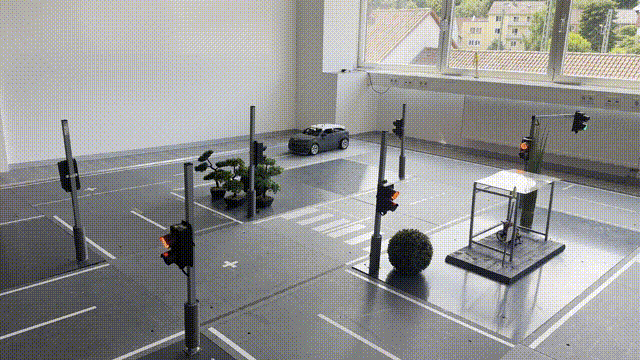
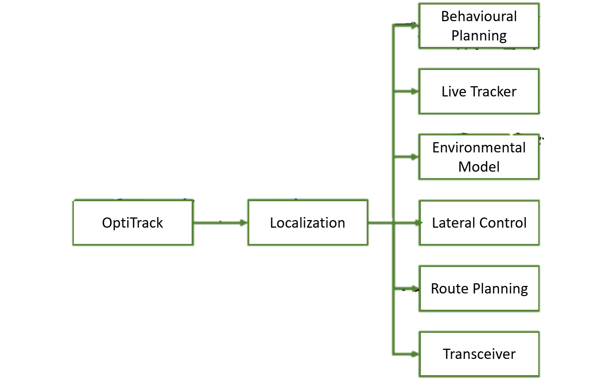
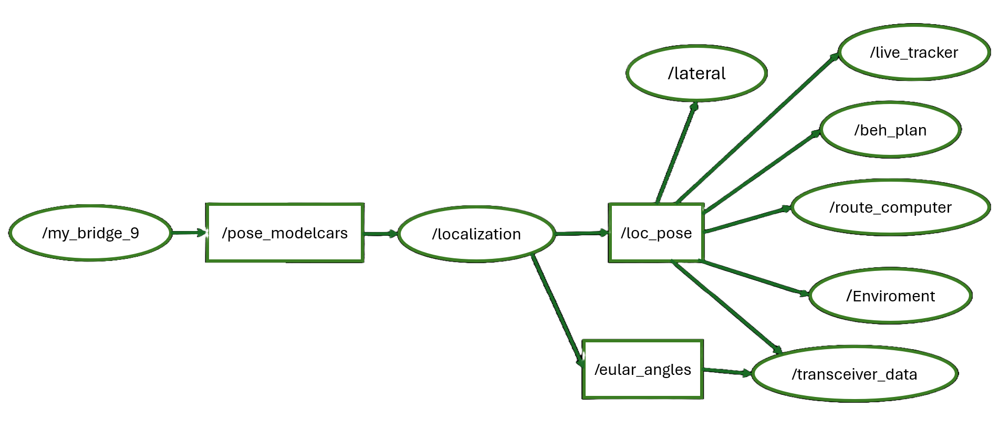
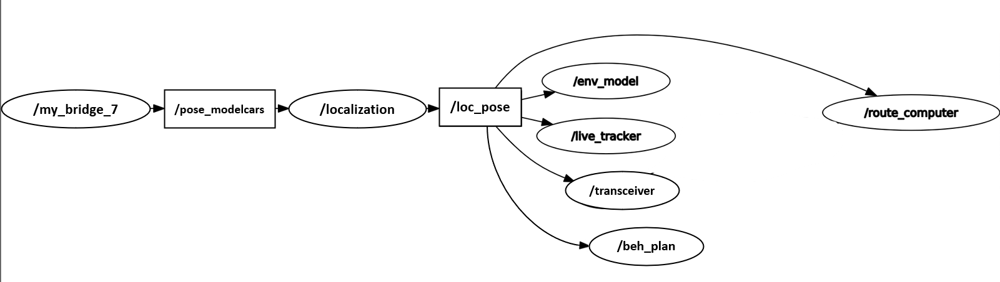
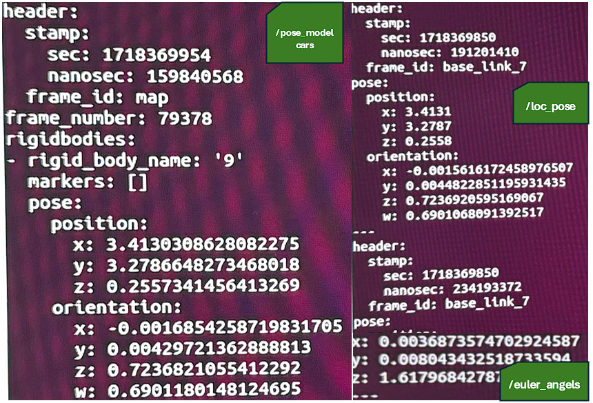
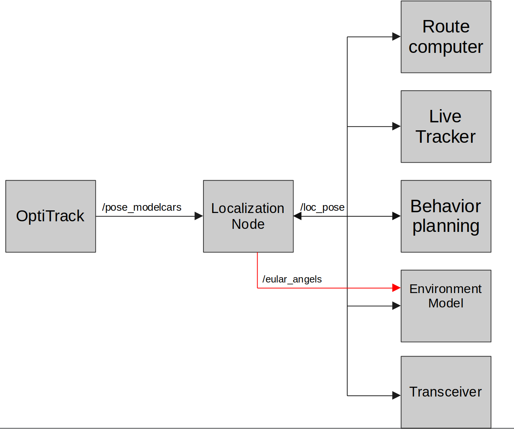
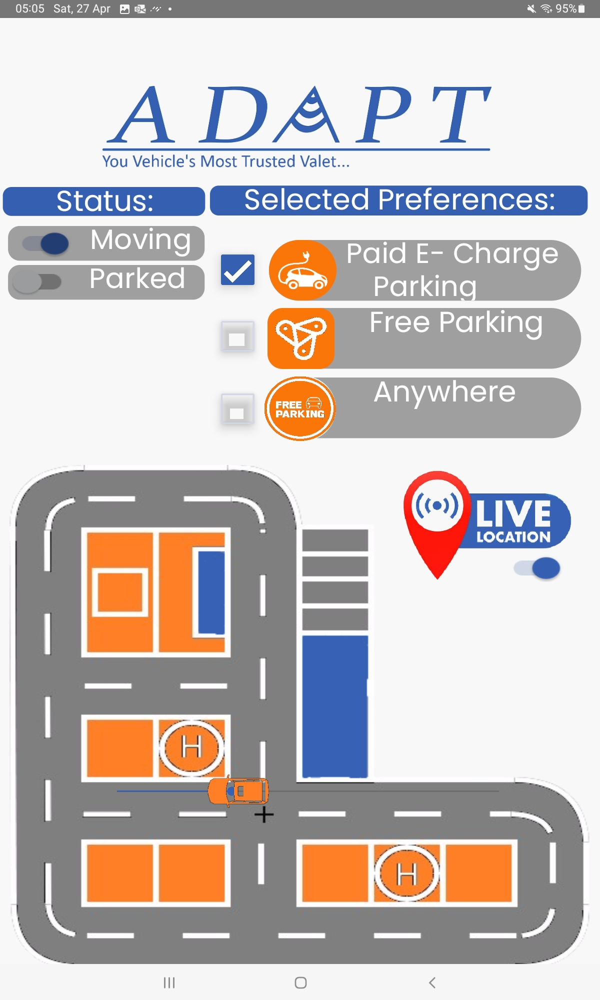

# Robot & Drone Localization (ROS 2)
### High‑Precision OptiTrack‑Based Localization for Autonomous Vehicles & Drones  
**By Ibrahim Al Dabbagh**

<p align="center">
  
</p>

---

## 🔥 Overview
The **Robot & Drone Localization** module is a ROS 2 (rclpy) node that converts **OptiTrack / motion‑capture** streams into clean, real‑time localization outputs used by an autonomous miniature vehicle and drone stack in a model city.  
It **selects the correct rigid body**, converts quaternion → **Euler (roll, pitch, yaw)**, stabilizes ENU coordinates, and publishes standardized ROS 2 messages that feed **route planning, behaviour planning, the environment model, lateral control, the V2X transceiver,** and **live tracking**.

**Demo (GIF, autoplay on GitHub):**  
> GitHub natively renders GIFs in READMEs. Your demo will play right on the repo page.

<p align="center">
  
</p>

---

## 🚗 Main Features
- **Real‑time 6‑DoF localization** from OptiTrack (via `mocap_msgs/RigidBodies`)
- **Rigid‑body filtering** (processes only the EV with name/id **"9"**)
- **Quaternion → Euler (RPY)** conversion
- **Stable ENU `PoseStamped`** publishing with controlled precision
- **ROS 2‑native** (Humble‑compatible `rclpy`)
- **Launch‑ready** via a minimal launch description
- **Lightweight & low latency** (single subscription callback, zero heavy deps)

---

## 📌 System Architecture

<p align="center">
  
</p>

**Pipeline**
1. **OptiTrack** publishes multi‑rigid‑body data on **`/pose_modelcars`**.  
2. **Localization Node** filters for rigid body **"9"** (the EV).  
3. Orientation is converted **quaternion → Euler (RPY)**; XYZ rounded to 4 decimals.  
4. Outputs are published to:  
   - **`/loc_pose`** → `geometry_msgs/PoseStamped` (ENU pose)  
   - **`/euler_angles`** → `geometry_msgs/Vector3` (roll, pitch, yaw, in radians)

---

## 🛰 RQT Graph (Topic Interaction)

<p align="center">
  
</p>

A cleaner variant:

<p align="center">
  
</p>

These diagrams show how one localization source drives **behaviour planning, route computing, live tracking, the environment model, control,** and the **transceiver**.

---

## 📡 Raw Input vs. Published Output

<p align="center">
  
</p>

- **Left:** `/pose_modelcars` (OptiTrack rigid body "9" with raw pose & quaternion)  
- **Right:** `/loc_pose` (ENU pose with rounded XYZ) and `/euler_angles` (RPY, radians)

---

## 🛰 RViz 3D Visualization
Real‑time visualization validating pose, heading, and LiDAR points.

<p align="center">
  
</p>

---

## 🧭 Downstream Consumers

<p align="center">
  
</p>

| Subsystem | What it consumes |
|---|---|
| Behaviour Planning | Pose & yaw for decision making |
| Live Tracker | Vehicle position overlays |
| Environment Model | Pose & orientation for world state |
| Lateral Control | Heading & position for controllers |
| Route Computer | Current ENU pose |
| Transceiver (V2X) | Pose broadcast to the network |

---

## 🧮 Mathematical Background (Quaternion → Euler)
Given quaternion components \((x, y, z, w)\), the ZYX (roll‑pitch‑yaw) convention used here is:

\[
\text{roll} = \text{atan2}\!\left(2(wx + yz),\, 1 - 2(x^2 + y^2)\right)
\]

\[
\text{pitch} = \text{asin}\!\left(2(wy - zx)\right)
\]

\[
\text{yaw} = \text{atan2}\!\left(2(wz + xy),\, 1 - 2(y^2 + z^2)\right)
\]

All angles are **radians**.

---

## 🧩 ROS 2 Interface (from the code)

**Subscribed**
- **`/pose_modelcars`** — `mocap_msgs/msg/RigidBodies` (all tracked bodies)

**Published**
- **`/loc_pose`** — `geometry_msgs/msg/PoseStamped`  
  - `header.frame_id = "base_link_7"`  
  - XYZ (meters) are **rounded to 4 decimals**
- **`/euler_angles`** — `geometry_msgs/msg/Vector3`  
  - \(x=\text{roll}, y=\text{pitch}, z=\text{yaw}\) in **radians**

**QoS**
- Depth **10** for the subscription and both publishers (sufficient for low‑latency MoCap feeds).

**Rigid‑body filter**
- Processes **only** the body with `rigid_body_name == "9"`.

**Logging**
- Info logs on node start and on each publish call (PoseStamped/Euler).

---

## 📂 Repository Structure
```
Robot_Drone_Localization/
├── localization.py        # ROS 2 node: subscription, conversion, publications
├── loc_launch.py          # LaunchDescription → Node(package='adapt_loc', executable='localization')
└── README.md              # This documentation
```

---

## 🧪 Example Console Output
```
[localization] Published PoseStamped: Position - x: 3.4131 m, y: 3.2787 m, z: 0.2558 m
[localization] Published Euler Angles: Roll: 0.0036 rad, Pitch: -0.0048 rad, Yaw: 1.6179 rad
```

---

## 🚀 Build & Run

**Build**
```bash
cd ~/ros2_ws/src
git clone <this_repository>
cd ~/ros2_ws
colcon build --symlink-install
source install/setup.bash
```

**Run executable**
```bash
ros2 run adapt_loc localization
```

**Or launch**
```bash
ros2 launch adapt_loc loc_launch.py
```

**Inspect topics**
```bash
ros2 topic echo /loc_pose
ros2 topic echo /euler_angles
```

---

## 🧱 Assumptions & Coordinate Frames
- Incoming data is **OptiTrack (MoCap)** rigid-body pose in the venue frame.  
- Outputs are intended for **ENU‑style** consumers; `frame_id` is currently set to **`base_link_7`**.  
- The node focuses on **absolute** localization (no fusion/filtering inside).

---

## 🛠️ Limitations (current code)
- Target **rigid body name is hard‑coded to "9"**.  
- `frame_id` hard‑coded to **`base_link_7`**.  
- No covariance estimates are published.  
- No TF broadcasting yet.

---

## 🗺️ Roadmap (recommended next steps)
- Add **ROS 2 parameters**:
  - `target_rigid_body` (default `"9"`)
  - `frame_id` (default `"base_link_7"`)
  - `rounding_precision` (default `4`)
  - `qos_depth` (default `10`)
- Publish **covariance** and support **PoseWithCovarianceStamped**.
- Add **TF broadcaster** for `map → base_link` (or `world → base_link`).
- Optional **EKF smoothing** or fusion with wheel odometry/IMU.
- Provide a **configurable topic name** for different MoCap bridges.
- Add **RViz markers** (heading arrow / trace path).

---

## 📱 ADAPT Companion UI
<p align="center">
  
</p>

---

## 🚗 Real Model‑City Vehicle
<p align="center">
  
</p>

---

## 👤 Author
**Ibrahim Al Dabbagh** — Robotics & Perception Engineer
